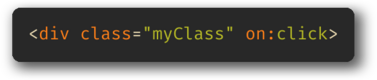
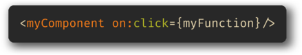
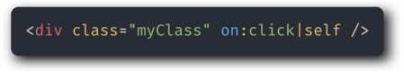
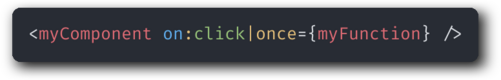

# [The Net Ninja's - Svelte Tutorial for Beginners](https://www.youtube.com/playlist?list=PL4cUxeGkcC9hlbrVO_2QFVqVPhlZmz7tO)

- [x] 1 - Introduction
- [x] 2 - Setting up a Svelte App

```
  npm install -g degit
  degit sveltejs/template myproject
  cd myproject
  npm run dev
```

- [x] 3 - Svelte Basics

* variables/data/logic in the `<script></script>` section
* `{var}` calls the vars/logic

- [x] 4 - User Input & Data Binding

* one way data binding
  - `<input type="text" on:input={handleInput}`
  - `<input type="text" value={beltColour} />`
* two way data binding
  - `<input type="text" bind:value={beltColour} />`

- [x] 5 - Reactive Values

* reactive value
  - `$: fullName = `${firstName} ${lastName}`;`
* reactive statement
  - single line
    - `$: console.log(beltColour);`
  - code block
    - ```javascipt
      $: {
        console.log(beltColour);
        console.log(fullName); // reacive name!!
      }
      ```

- [x] 6 - Loops
  - ```sveltejs
    {#each myArray as myObject (myObject.id)}
      {myObject.myProperty}
      {:else}
      <-- do something -->
    {/each}
    ```
- [x] 7 - Inline Event Handlers
  - `<button on:click={() => handleClick(person.id)}> delete </button>`
- [x] 8 - Conditionals
  - ```sveltejs
    {#if condition}
      // do stuff
      {:else if condition}
      // do other stuff
      {:else}
      // fallback
    {/if}
    ```
- [x] 9 - Components
  - create `NewComponent.svelte`
  - `import NewComponent from "./NewComponent.svelte";`
  - `<NewComponent />`
- [x] 10 - CSS & Conditional Styles
  - global css in `/public/global.css`
  - component css in myComponent.svelte -> `<style> </style>`
  - conditional css `class:myCondition={bool}`
- [x] 11 - Props
  - prop variables in component
    - `<myComponent propValue="value"/>`
  - in Components script
    - `export let propValue;`
    - usage: `{propValue}`
- [x] 12 - Event Forwarding
  - `on:click` in component (no function calling)
  - 
  - in `<myComponent on:click={myFunction}>`
  - 
- [x] 13 - Event Modifiers
  - `self`  
     only trigger handler if `event.target` is the element itself  
     
  - `once`  
    remove the handler after the first time it runs  
    
  - https://svelte.dev/docs#template-syntax-element-directives-on-eventname
- [x] 14 - Slots
  - Unnamed Slots
    - in App.svelte
      - `<myComponent> <!-- content here --> </myComponent>`
    - in myComponent.svelte
      - content is rendered at `<slot/>`
  - Named Slots
    - in App.svelte
      - `<div slot="myNamedSlot"> <!-- content here --> </div>`
      - content is rendered at `<div name="myNamedSlot"/>`
- [x] 15 - Forms (part 1)
  - bind variables to input elements
    - `<input type="text" bind:value={myVar} />`
      - if `type` is `number` the variable will be a number
    - `preventDefault` prevents the form reloading the page
      - `<form on:submit|preventDefault={myFunction}>`
- [x] 16 - Forms (part 2)
  - `bind:group={myArray}` add value to `myArray[]`
  - `<select bind:value={var}>` bind value of `<option>` to `var`
- [x] 17 - Dispatching Custom Events
  - in `myComponent`
    - `import { createEventDispatcher } from "svelte";`
    - `<form on:submit|preventDefault={handleSubmit}>`
    - in `handleSumbit` => `dispatch("customEventName", myObject)`
  - in `App`
    - `<myComponent on:customEventName={myFunction}/>`
    - `const myFunction = (e) => { // do stuff };`

---

- [x] 18 - Starting the Polls Project
  - 
- [x] 19 - Header & Footer Components
- [x] 20 - Reusable Tabs Component
- [x] 21 - Poll Form Component
- [ ] 22 - Custom Button Component
- [ ] 23 - Custom Form Validation
- [ ] 24 - Adding New Polls
- [ ] 25 - Poll Details Component
- [ ] 26 - Card Component
- [ ] 27 - Casting Votes
- [ ] 28 - Vote Bars
- [ ] 29 - Introduction to Stores
- [ ] 30 - Lifecycle Hooks
- [ ] 31 - Updating Store Data
- [ ] 32 - Deleting Polls
- [ ] 33 - Transition Basics
- [ ] 34 - Tweens & Animations
- [ ] 35 - Wrap Up
